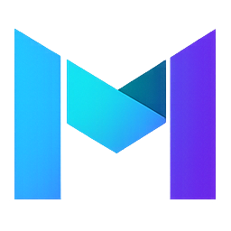
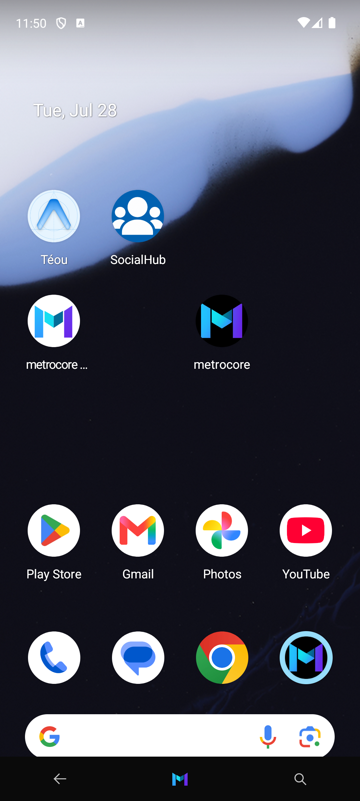
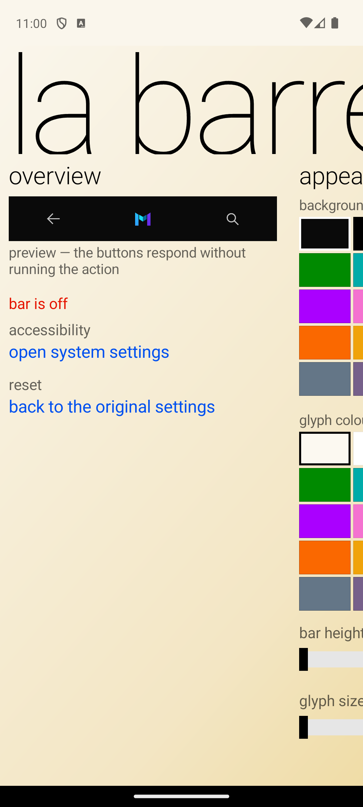
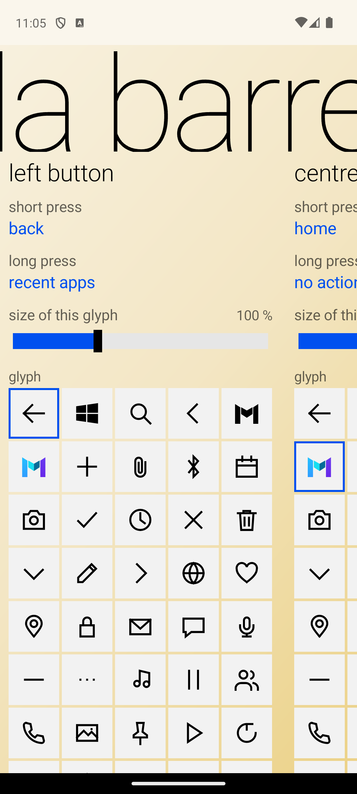
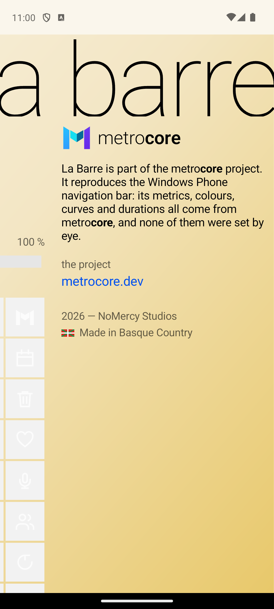
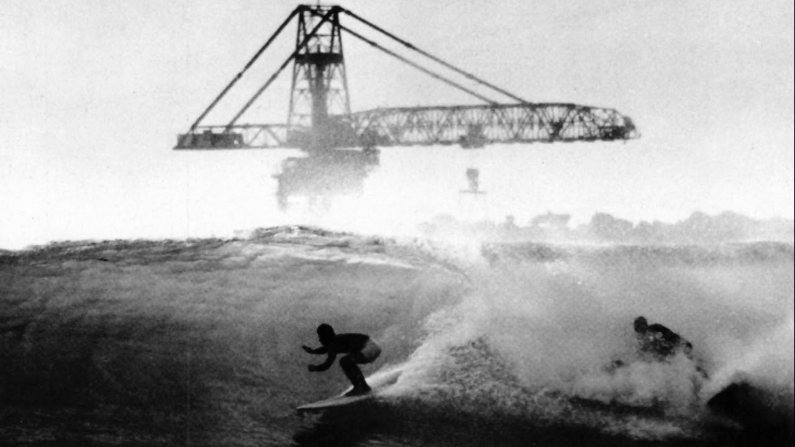
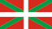

<p align="center">
  
</p>

<h1 align="center">La Barre</h1>

<p align="center">
  <b>La barre de navigation Windows Phone, reconstruite sur Android.</b><br>
  Un projet <a href="https://metrocore.dev">metro<b>core</b></a>.
</p>

<p align="center">
  <a href="https://metrocore.dev">metrocore.dev</a> ·
  <a href="https://navbar.metrocore.dev">navbar.metrocore.dev</a>
</p>

<p align="center">
  
</p>

---

Trois boutons, en overlay tout en bas de l'écran. Réglages par défaut :

| Bouton | Glyphe | Appui court | Appui long |
|---|---|---|---|
| Gauche | ← flèche | Précédent | Applis récentes |
| Centre | logo metrocore (couleur) | Accueil | — |
| Droite | 🔍 loupe | Recherche système | — |

Tout est modifiable depuis l'écran de réglages : couleur du fond et des glyphes
(les 20 accents WP8.1), hauteur de la barre, taille des glyphes, vibration, et pour
chacun des trois boutons une glyphe parmi 45, sa taille propre, et une action par appui
court et par appui long.

<p align="center">
  
  
  
</p>

<p align="center"><i>
  L'écran de réglages est un panorama : une seule toile plus large que l'écran,<br>
  parcourue horizontalement, avec trois couches à trois vitesses.
</i></p>

Les actions disponibles : précédent, accueil, applis récentes, notifications, réglages
rapides, menu marche/arrêt, écran partagé, verrouiller, capture d'écran, recherche
système / assistant / vocale / web, **ouvrir une application**, et **action rapide**.

### Sur la recherche

Windows Phone indexait localement contacts, messages, musique et applications, et posait
le web par-dessus, le tout derrière une seule touche. **Android n'a pas cet
équivalent** : l'index local appartient au lanceur et n'est pas exposé. « recherche
système » est ce qui s'en approche le plus — elle tente la Quick Search Box (l'ancienne
recherche appareil + web, encore présente sur beaucoup d'appareils), puis l'assistant,
puis le web seul, et prend la première qui répond.

De même, les raccourcis que le système affiche sous l'icône d'une application ne sont
lisibles que par le lanceur par défaut (`LauncherApps` exige ce rôle). « action
rapide » passe donc par `ACTION_CREATE_SHORTCUT` : l'application ouvre son propre
sélecteur et rend un intent, qu'on rejoue ensuite. Toutes les applications ne le
proposent pas.

## Setup (une seule fois, sur le téléphone)

1. Installer l'APK.
2. Ouvrir **metrocore — La Barre** → section *vue d'ensemble* → **ouvrir les réglages
   système**.
3. Dans les réglages d'accessibilité, ouvrir **metrocore — La Barre** (souvent sous
   *Applications installées* / *Services téléchargés*), activer l'interrupteur, confirmer.
4. La barre apparaît immédiatement. Pour l'enlever : désactiver le même interrupteur.

## Fidélité : d'où viennent les constantes

Rien n'est réglé à l'œil. Métriques, couleurs, courbes et durées viennent de
[metrocore](../metrocore) — `spec/tokens.json` et `src/` — et sont reportées dans
[MetroTokens.kt](app/src/main/java/dev/metrocore/navbar/MetroTokens.kt) :

- **hauteur de barre** — WP posait 60 px de bande sur un écran large de 480 px, soit
  un huitième de la largeur. On ancre sur la **largeur** et non sur la hauteur : les
  téléphones actuels sont bien plus allongés que le 5:3 du WVGA, et un ratio pris sur
  la hauteur donnerait une bande énorme. Sur un écran de 411 dp ça fait 51 dp.
- **taille des glyphes** — le tiers de la bande (20 sur 60), d'où le « auto (33 %) ».
- **retour visuel** — l'opacité tombe à 45 % en 100 ms et remonte en 200 ms, avec un
  enfoncement à 0.985. C'est `.mc-navkey.is-down` et les tokens `tilt`. Pas
  d'ondulation Material : c'est exactement le détail qui trahirait la reconstruction.
- **appui long** — 550 ms (`hold-ms`), et il *annule* l'appui court.
- **accents** — les vingt teintes stock de WP8.1, ni plus ni moins.
- **glyphes** — générées depuis `metrocore/src/controls/icons.ts` par
  [tools/gen-icons.mjs](tools/gen-icons.mjs) ; `android:pathData` accepte la même
  grammaire que SVG, donc les chaînes sont recopiées telles quelles.

L'écran de réglages est un **panorama** (`metrocore/src/nav/panorama.ts`) : une seule
toile plus large que l'écran, parcourue horizontalement, avec trois couches à trois
vitesses — fond 0.30×, contenu 1.00×, et le titre entre les deux. Les sections font 0.8
écran pour que la suivante dépasse toujours à droite, et le titre surdimensionné est
coupé par les deux bords, volontairement. Les contrôles (interrupteur, pastilles,
radios, ListPicker plein écran) suivent `metrocore/src/styles/controls.css`.

Sept sections : vue d'ensemble, apparence, retour, un par bouton, et metrocore.

L'écran est en **thème clair** — dégradé crème → or, texte noir — pris sur le thème
clair de metrocore (`spec/tokens.json` → `themes.light`), qui était un réglage système à
part entière sur WP et pas une arrière-pensée. Les deux palettes sont définies dans
[MetroTokens.kt](app/src/main/java/dev/metrocore/navbar/MetroTokens.kt) ; `MetroUi` en
prend une et tout en découle. La barre elle-même garde sa palette propre, réglée dans
l'app.

Le même dégradé est posé deux fois : sur la couche de fond mobile, et sur le panorama
lui-même. Tirer au-delà des extrémités décale la couche mobile et découvrirait sinon le
fond nu — là on retombe sur la même teinte, crème à gauche, or à droite. Le débordement
est en plus amorti (`scroll-rubber-limit`, 90 px).

Une nuance sur le titre : metrocore le fait défiler à 0.60× fixe. Ici sa vitesse est
calculée pour qu'il **finisse sa course en même temps que le contenu** (plafonnée à
0.60×). Avec un titre court comme « La Barre » et sept sections, un taux fixe l'aurait
emmené hors de l'écran dès la troisième — alors qu'un panorama garde son titre visible
jusqu'au bout.

### Sur le logo Windows

metrocore a volontairement retiré le drapeau Windows au profit d'une glyphe « metro »
maison : le glyphe d'origine était exact, mais une marque déposée est la seule chose
qu'une reconstruction ne peut pas reproduire. Les trois sont fournies : `metrocolor`
(le logo metrocore en couleur) est le défaut de la touche centrale, `metro` en est la
version monochrome, et `windows` reste dans le sélecteur pour qui veut le drapeau
d'origine.

## Langues

L'app suit la langue du téléphone. L'anglais est la langue par défaut
(`values/strings.xml`) et sert de repli pour toute langue non couverte.

| | | | |
|---|---|---|---|
| `fr` français | `de` allemand | `ru` russe | `ko` coréen |
| `es` espagnol | `pl` polonais | `zh` chinois simplifié | `ar` arabe |
| `pt` portugais | `it` italien | `ja` japonais | `eu` euskara |

63 chaînes traduisibles par langue, toutes présentes dans les douze fichiers. Les 6
restantes sont les noms de produit — « metrocore — La Barre », « La Barre »,
« metrocore », « metrocore.dev » — marqués `translatable="false"` : elles n'existent que
dans le fichier par défaut et ne bougent dans aucune langue.

Trois remarques :

- **L'euskara n'a pas été relu par un locuteur natif.** Il est marqué comme tel en tête
  de [values-eu/strings.xml](app/src/main/res/values-eu/strings.xml) ; à faire corriger
  avant publication — c'est la langue du pied de page, autant qu'elle soit juste.
- **L'allemand est en minuscules, substantifs compris.** C'est la règle de style Metro,
  pas une coquille : Windows Phone composait son interface allemande ainsi.
- **L'arabe s'affiche en RTL mais la mise en page reste LTR.** `supportsRtl` est à
  `false` : le texte arabe se rend correctement et s'aligne à droite dans chaque bloc,
  mais le panorama défile de gauche à droite par construction. Activer le RTL
  retournerait marges et alignements sans retourner le panorama — un miroir à moitié se
  voit plus qu'un sens assumé. Le miroir complet est un chantier à part.

Pour tester une langue sans changer celle du téléphone (Android 13+) :

```bash
adb shell cmd locale set-app-locales dev.metrocore.navbar --locales ja
adb shell cmd locale set-app-locales dev.metrocore.navbar --locales ""   # retour au système
```

## Régénérer les glyphes

```bash
node tools/gen-icons.mjs [chemin/vers/metrocore]   # défaut : ../metrocore
```

Écrit `app/src/main/res/drawable/ic_mc_*.xml` et
`app/src/main/java/dev/metrocore/navbar/NavIcons.kt`. Les deux sont versionnés : on ne
régénère que si metrocore bouge.

Aucune autre permission n'est demandée — pas de « Affichage par-dessus les autres
applications ». L'overlay utilise `TYPE_ACCESSIBILITY_OVERLAY`, fourni par le service
d'accessibilité lui-même.

## Build & run depuis VS Code (F5)

`F5` lance la configuration sélectionnée dans le menu déroulant **Run and Debug** :

| Configuration | Effet |
|---|---|
| **Build & Install -> Emulateur** (défaut) | démarre l'AVD s'il ne tourne pas, attend la fin du boot, build, installe, lance l'app |
| **Build & Install -> Appareil USB** | même chose sur le téléphone branché en USB |

Même chose en tâches : `Ctrl+Shift+B` pour l'émulateur, ou `Ctrl+Shift+P` →
*Run Task* pour choisir la cible.

Le script derrière tout ça : [.vscode/run-android.ps1](.vscode/run-android.ps1). Il
retrouve le SDK via `local.properties` (ou `ANDROID_HOME`), sélectionne la bonne cible,
et force `ANDROID_SERIAL` pour que Gradle installe au bon endroit même si un émulateur
et un téléphone sont connectés en même temps.

## Build en ligne de commande

```bash
./gradlew assembleDebug
# APK : app/build/outputs/apk/debug/app-debug.apk

# installation directe sur un appareil branché en USB (débogage USB activé)
./gradlew installDebug
```

`local.properties` (chemin du SDK Android) est généré localement et non versionné.

## Structure

- [MetroTokens.kt](app/src/main/java/dev/metrocore/navbar/MetroTokens.kt) — les constantes
  portées de metrocore, avec la conversion WVGA → écran réel.
- [NavBarConfig.kt](app/src/main/java/dev/metrocore/navbar/NavBarConfig.kt) — l'état
  complet + sa persistance.
- [NavBarView.kt](app/src/main/java/dev/metrocore/navbar/NavBarView.kt) — construction de
  la barre. Le **même** code sert à l'overlay et à l'aperçu des réglages, donc l'aperçu
  ne peut pas mentir.
- [NavKeyView.kt](app/src/main/java/dev/metrocore/navbar/NavKeyView.kt) — une touche :
  appui, maintien, retour visuel, haptique.
- [NavBarService.kt](app/src/main/java/dev/metrocore/navbar/NavBarService.kt) — le service
  d'accessibilité.
- [MetroUi.kt](app/src/main/java/dev/metrocore/navbar/MetroUi.kt) — les briques Metro
  (interrupteur, pastilles, radios, ListPicker, slider), dessinées à la main.
- [PanoramaView.kt](app/src/main/java/dev/metrocore/navbar/PanoramaView.kt) — le panorama.
- [MainActivity.kt](app/src/main/java/dev/metrocore/navbar/MainActivity.kt) — l'écran de
  réglages.
- [AppTargets.kt](app/src/main/java/dev/metrocore/navbar/AppTargets.kt) — l'inventaire des
  applications lançables et des fournisseurs d'actions rapides.

### Un piège de layout, pour mémoire

Le rail du panorama fait la largeur de **tout** le panorama, pas celle de l'écran. Un
parent qui découpe ses enfants les découpe à leurs propres bornes : un rail large d'un
écran se fait rogner à un écran, et une section posée à 864 px n'est alors dessinée que
sur `1080 - 864` px. Le symptôme est reconnaissable — la coupure tombe pile sur la
largeur d'écran, alors que mesures et `layout` sont tous corrects.

Les réglages passent par les `SharedPreferences` et le service les écoute : l'écran
écrit, la barre se reconstruit toute seule. Aucun binder à maintenir entre les deux.

## Limites connues

- La barre se superpose au contenu ; elle ne réserve pas d'espace (pas d'inset système).
  En navigation gestuelle Android c'est peu gênant, en navigation à 3 boutons elle se
  pose par-dessus la barre système.
- Pas de masquage automatique en plein écran, ni de swipe-up pour la rappeler.
- L'arabe est traduit mais la mise en page n'est pas en miroir (voir *Langues*).
- La compilation `release` est encore signée avec la clé de debug — à remplacer par une
  vraie clé avant toute distribution. Voir [SIGNING.md](SIGNING.md).

## Licence et crédits

Les métriques, couleurs, courbes et glyphes viennent de
[metrocore](https://metrocore.dev), sous licence MPL-2.0.

Windows Phone, Windows et le logo Windows sont des marques de Microsoft. Ce projet est
une reconstruction indépendante, sans lien avec Microsoft. Le drapeau Windows n'est
fourni que comme glyphe optionnelle ; le défaut est le logo metrocore.

<p align="center">
  
</p>

<p align="center">
  2026 — <b>NoMercy Studios</b> —
  
  Made in Basque Country
</p>
